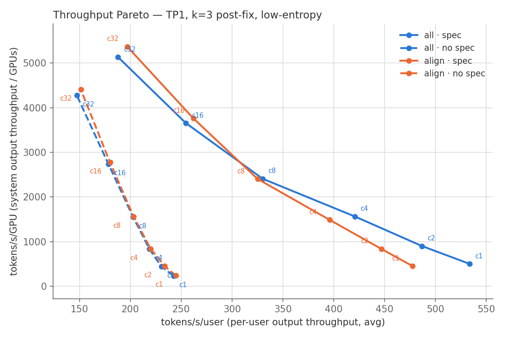
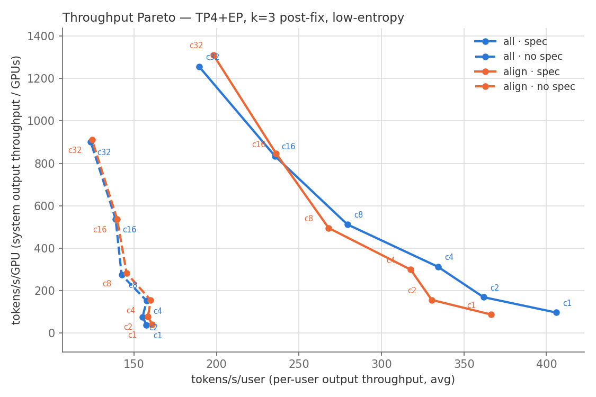
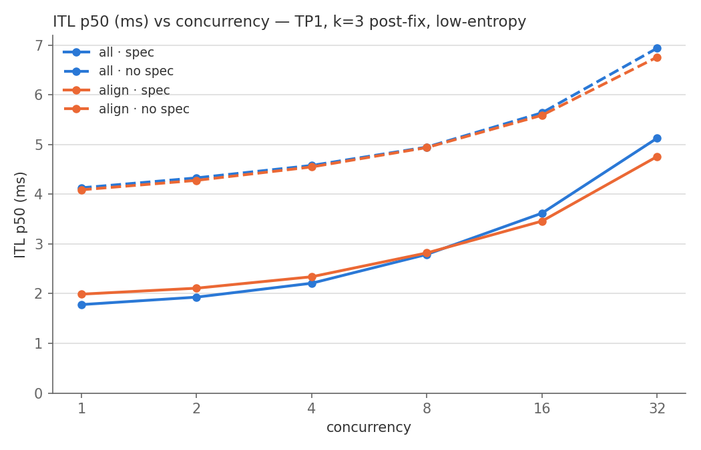
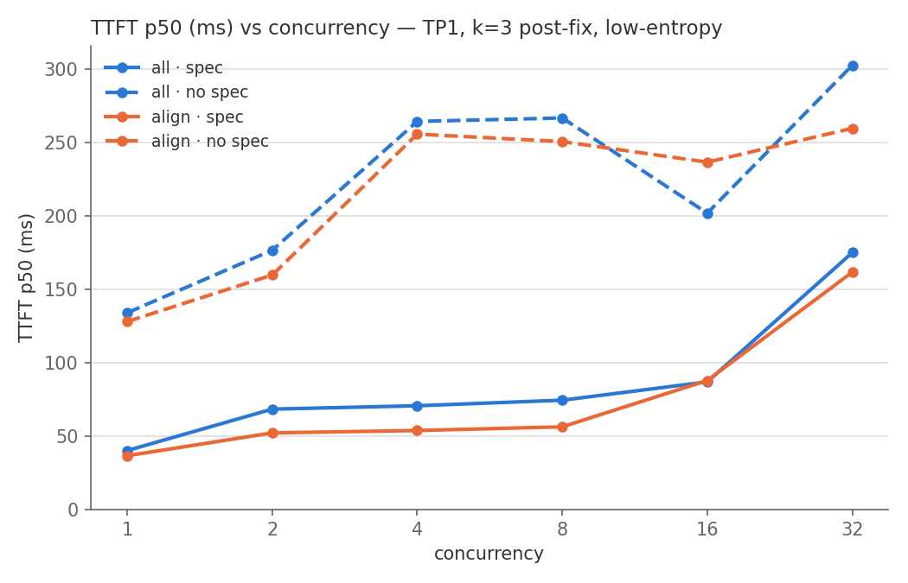
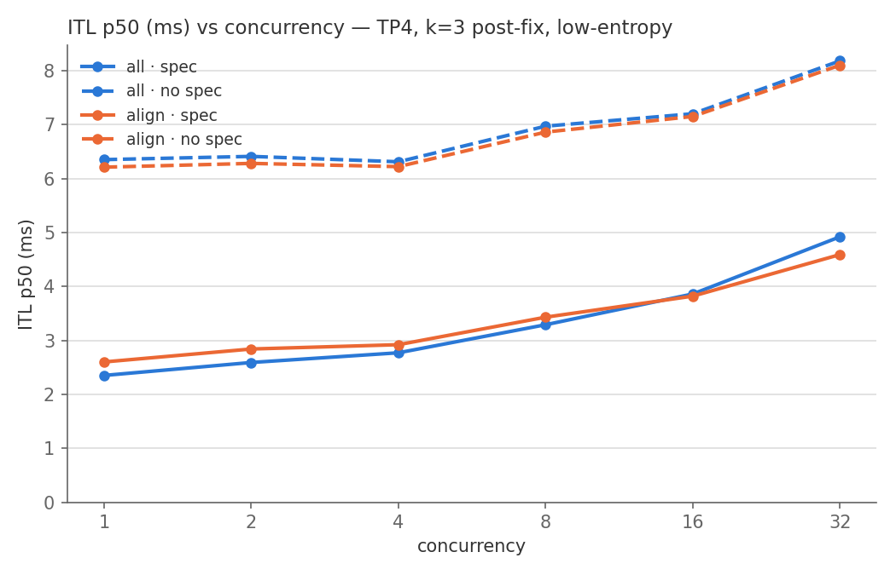
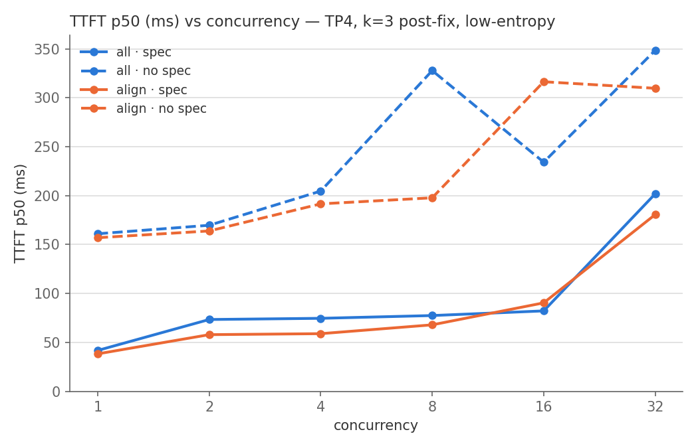
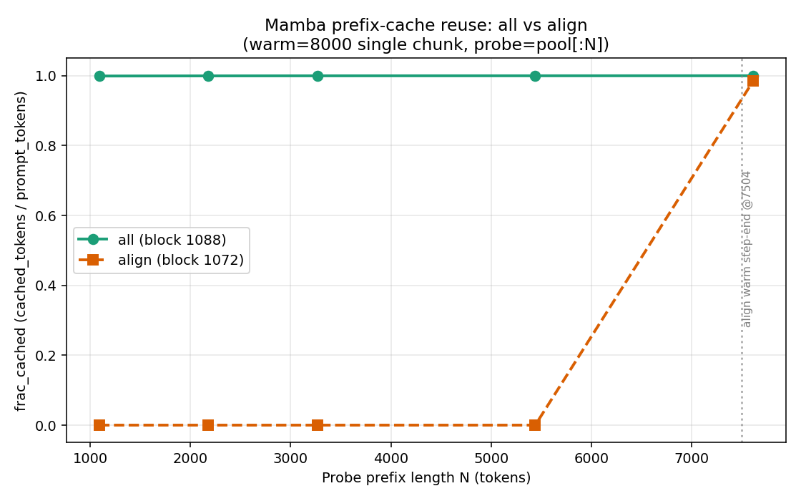

# Benchmark results — GDN all-mode prefix caching + MTP (PR #50172)

Full concurrency sweeps on the PR branch (`num_speculative_tokens=3`, 240-prompt
low-entropy Spec-Bench per level, count-bound, greedy, seed 42, B200).

## ITL p50 (ms) — all vs align

| | c1 | c2 | c4 | c8 | c16 | c32 |
|---|---|---|---|---|---|---|
| TP1 all+spec | 1.78 | 1.93 | 2.21 | 2.79 | 3.62 | 5.13 |
| TP1 align+spec | 1.99 | 2.11 | 2.34 | 2.82 | 3.46 | 4.76 |
| TP1 all nospec | 4.13 | 4.33 | 4.58 | 4.95 | 5.64 | 6.94 |
| TP1 align nospec | 4.09 | 4.28 | 4.55 | 4.94 | 5.59 | 6.76 |
| TP4+EP all+spec | 2.35 | 2.59 | 2.77 | 3.29 | 3.86 | 4.92 |
| TP4+EP align+spec | 2.60 | 2.84 | 2.92 | 3.43 | 3.82 | 4.59 |
| TP4+EP all nospec | 6.35 | 6.41 | 6.31 | 6.97 | 7.20 | 8.18 |
| TP4+EP align nospec | 6.21 | 6.28 | 6.22 | 6.86 | 7.15 | 8.10 |

Without speculation, all-mode is at parity with align across the whole grid
(within 0.05–0.2 ms everywhere, both TPs). With speculation, all-mode is faster
than align at low-to-mid concurrency and within 7–8% at c32.

## Throughput Pareto (tokens/s/GPU vs tokens/s/user; concurrency annotated)

## Latency vs concurrency (blue = all, orange = align; solid = spec, dashed = no-spec)

p95 variants: [TP1 ITL](../plots/tp1_itl_p95.png), [TP1 TTFT](../plots/tp1_ttft_p95.png),
[TP4 ITL](../plots/tp4_itl_p95.png), [TP4 TTFT](../plots/tp4_ttft_p95.png).

## Prefix-reuse probe (the structural mechanism)

Warm one 8,000-token context in a single prefill chunk, probe with leading
prefixes of length N. All-mode (block 1088) serves ~100% of every probe from
cache — a checkpoint exists at every block boundary. Align (block 1072) has a
single checkpoint at its warm step end (token 7,504): every probe below it is a
full recompute (0% reuse). Concurrency 1, Qwen3-Next-80B, B200.
